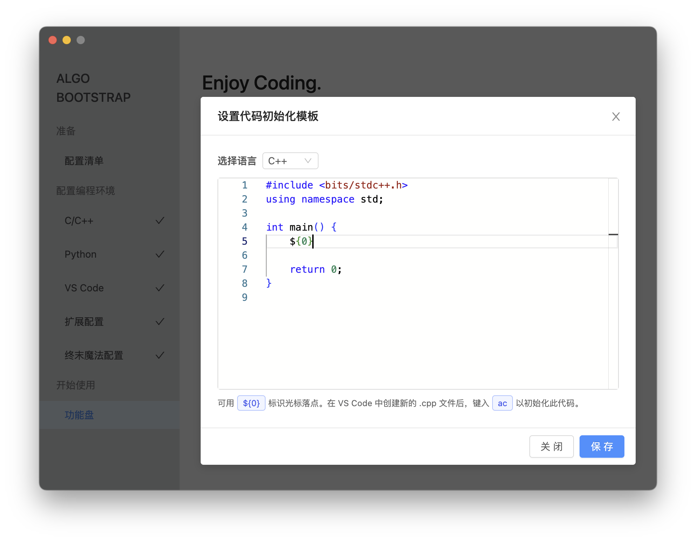

# 设置代码初始化模板

对于经常编写代码解决程序设计难题的用户，Algo Bootstrap 内置的 `ac` 代码片段功能是不可或缺的常用功能。但默认模板可能无法满足需求，这时可以定制自己的代码初始化模板。

## 使用方式

打开 Algo Bootstrap，在功能盘中点击「设置代码初始化模板」按钮。

选择要设置的语言，输入或粘贴你想要的代码模板。别忘了使用占位符 `${0}` 作为初始化完毕后光标自动跳转的落点。

点击保存，配置将立即生效。返回 VS Code，在新文件中键入 `ac` 并按 `Tab` 键来使用新模板。
