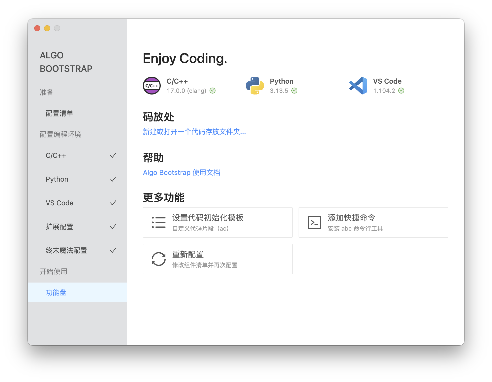
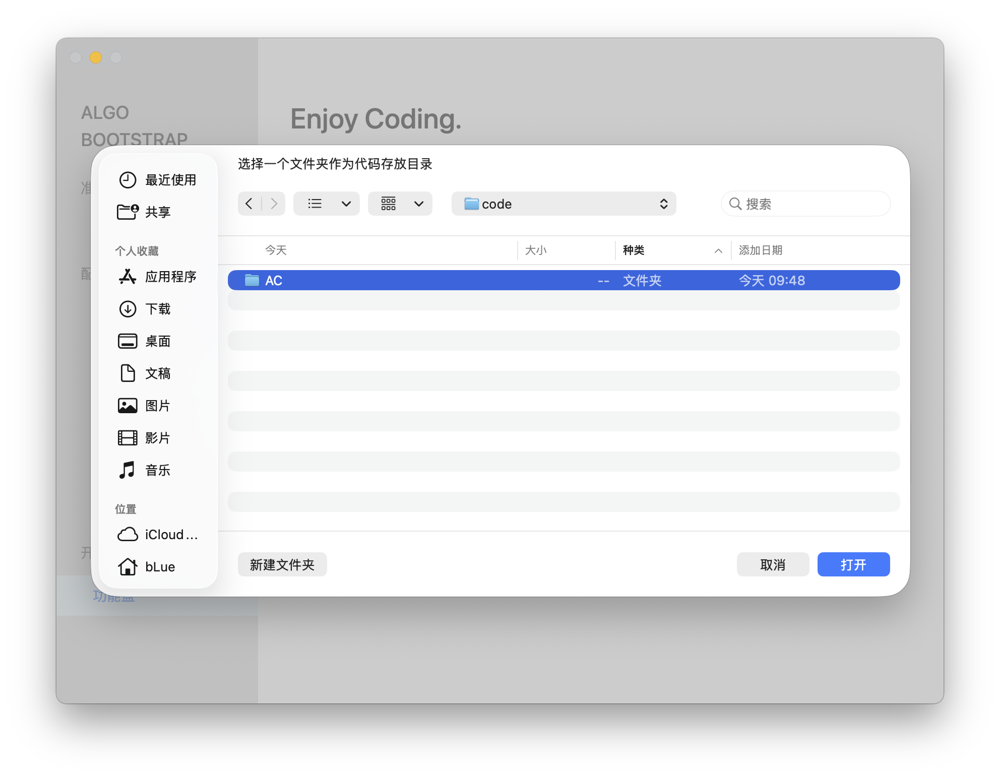
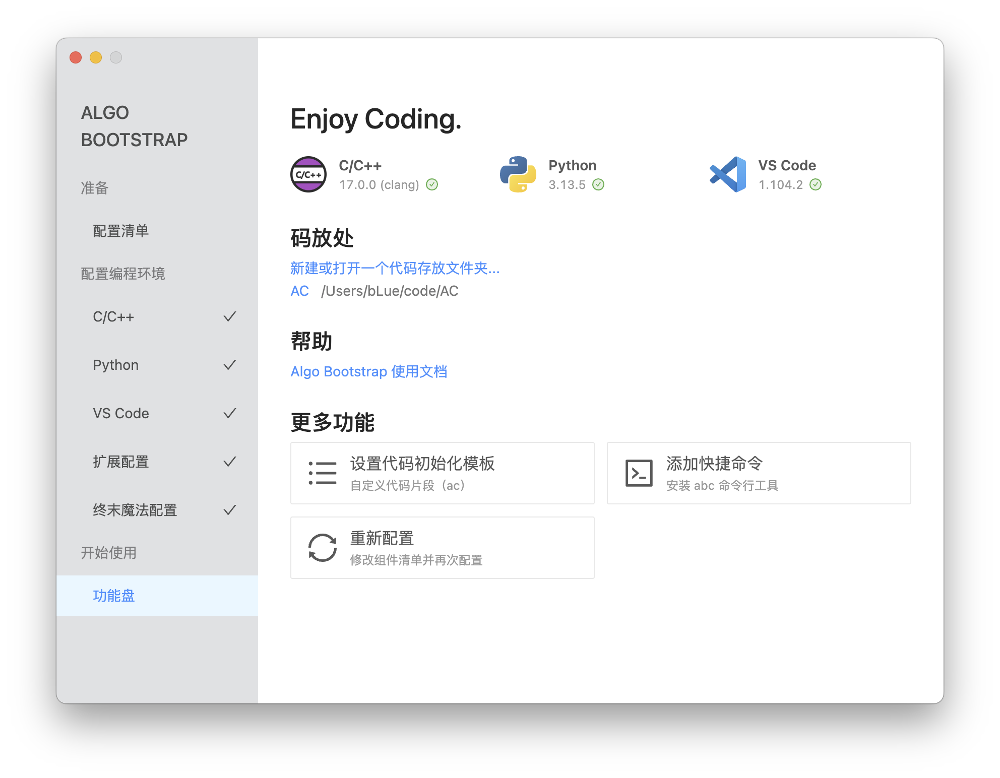
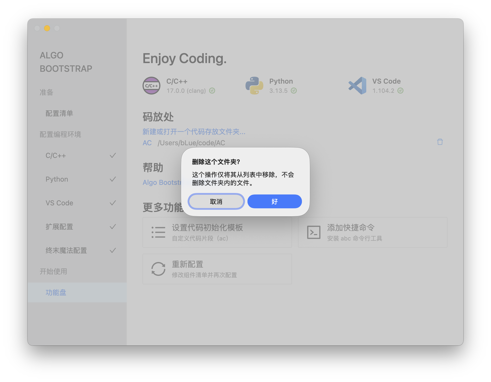

# 使用代码存放文件夹

你需要先打开一个代码存放文件夹，这样才能使用编辑器（VS Code）进行编程。

## 打开码放文件夹

在 Algo Bootstrap 功能盘界面的「码放处」点击「新建或打开一个代码存放文件夹...」，选择一个文件夹作为代码存放目录。

你可以在这里新建空文件夹，也可以打开已有代码的文件夹。

::: tip

界面截图以 macOS 版本为例。若你使用 Windows 版本，部分系统界面将会存在细微差别。

:::

选择目录后，Algo Bootstrap 会自动初始化文件夹，并打开 VS Code。

## 快捷访问码放文件夹

一旦打开过文件夹，「码放处」的快捷访问列表中便会显示你打开过的文件夹，你可以点击列表中的项目快速打开文件夹。

## 删除码放文件夹记录

如果你不再需要快速访问某个文件夹，可以在「码放处」的快捷访问列表中点击「删除」按钮删除该文件夹记录。

---

::: tip

你也可以在 VS Code 中直接打开或管理文件夹。

:::
