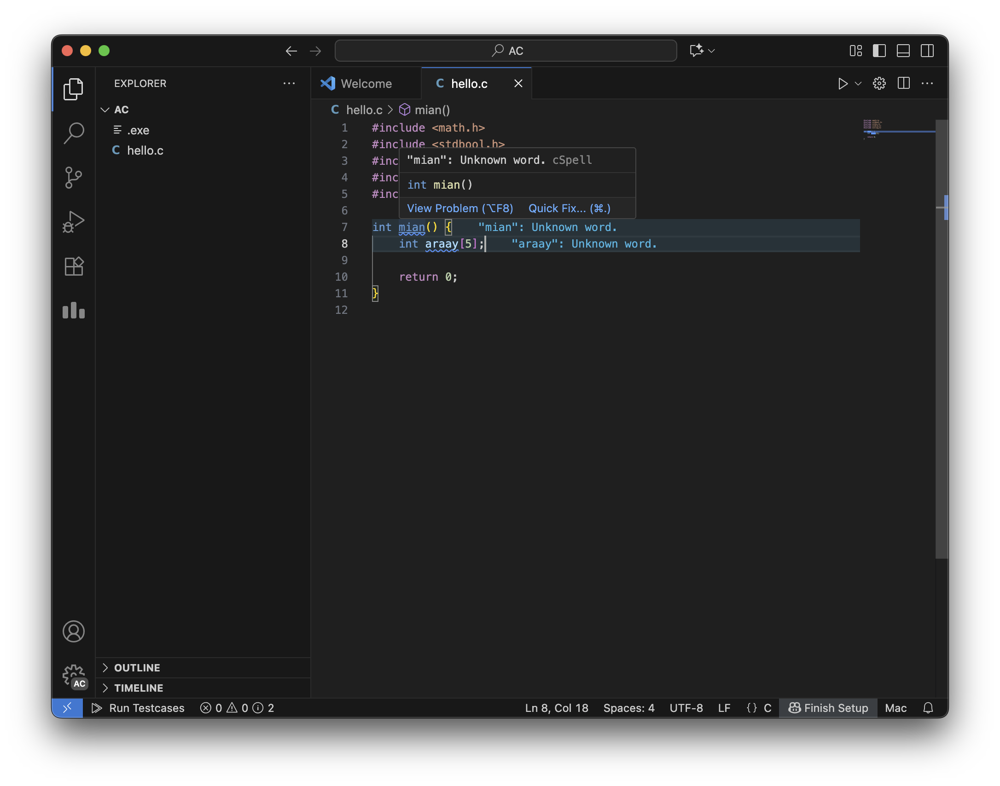
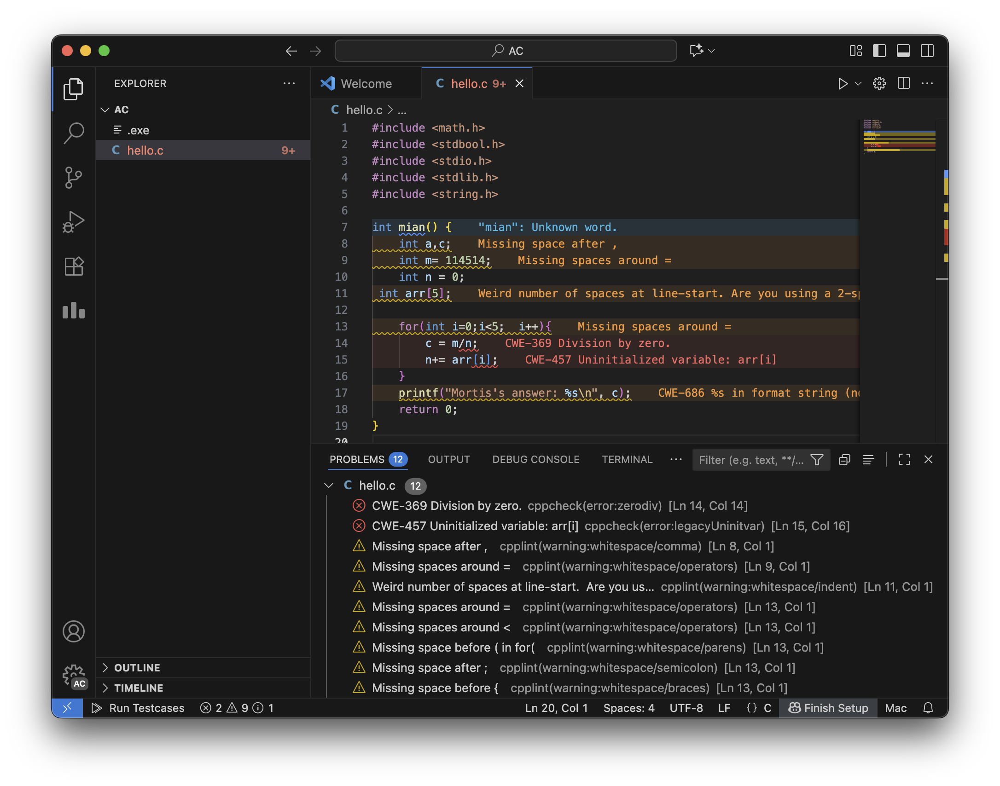

# 辅助功能

Algo Bootstrap 集成了许多适用于编程初学者的辅助功能。

## 拼写检查

内置的拼写检查扩展可以帮助你检查潜在的拼写错误的单词。这对新手纠正拼写错误，养成良好的命名习惯应该有用。除了检查，亦可通过「Quick Fix...」功能快速修复拼写错误。

## 代码风格和潜在错误检查

若配置了代码风格辅助扩展，在编写 C/C++ 代码时，便可以通过代码风格检查和潜在错误检查来智能发现问题，帮助提升代码质量。

只要保存代码即可触发检查。你也可以通过打开「Problems」面板查看更多错误。

