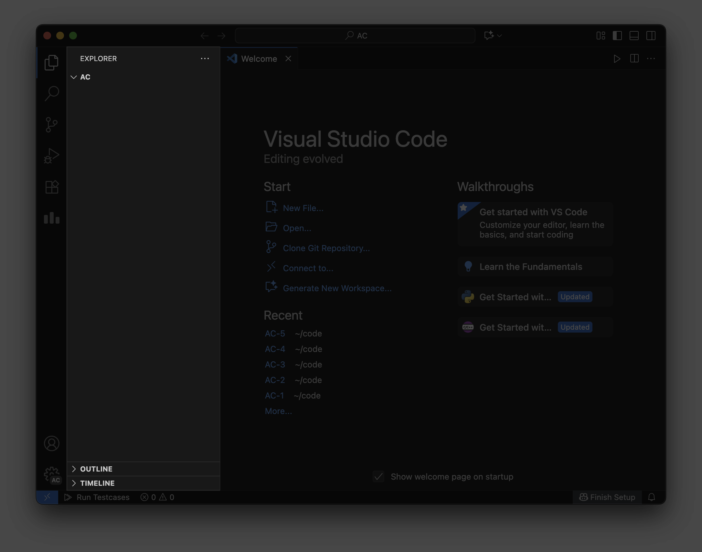

# VS Code 基本使用

VS Code 是当前最流行的代码编辑器之一。其轻量化、高度可定制的特性尤其适合编程初学者和算竞选手。

当通过 Algo Bootstrap 打开代码存放文件夹后，会自动使用 VS Code 打开此文件夹。你将看到类似下图的界面。

右侧的欢迎界面也是手动打开 VS Code 新窗口时显示的界面。当熟练使用 VS Code 后，你可以完全通过 VS Code 打开和管理文件夹。

## 熟悉界面

在 VS Code 中，左侧的竖条区域被称为「活动栏」，其上半区域是主要功能的面板图标，下半区域则是用户配置和设置按钮。

在活动栏右侧的稍宽竖条区域被称为「主侧边栏」，它会根据当前选择的活动栏功能变化。

右侧最大面积的区域是「编辑器」，它将显示打开的文件以及代码内容。

对于初上手 VS Code 的用户，通常只需要关注第一个功能面板：Explorer（资源管理器）。如果发现主侧边栏的内容变为其他不认识的界面，可以点击左上角的资源管理器图标切换。

::: tip

如果发现部分编辑和调试功能不生效，请检查左下角的设置齿轮图标是否带有 `AC` 角标。

Algo Bootstrap 使用配置文件为你增强 VS Code。如果你手动启动 VS Code 来打开新目录，它可能不会自动使用该配置文件。如果此情况发生，你可以点击设置齿轮图标，进入「Profile」菜单，手动切换到含有 `AC` 和 `Algo Bootstrap` 字样的配置文件。

:::

## 新建文件

点击聚焦到资源管理器面板，之后点击上方的新建文件按钮或在右键菜单中点击「New File...」，即可输入文件名，新建一个文件。

在这里，我们新建一个名为 `hello.c` 的 C 语言代码文件为例。

## 编辑文件

新的文件将自动打开，在右侧的编辑器区域即可键入代码。

Algo Bootstrap 已为 C/C++ 语言内置了快速初始化代码功能。键入 `ac` 并按 `Tab` 键即可快速将初始内容填充到你的代码中。

内置的代码模板将自动填充到文件中，按 `Ctrl + S` / `Command + S` 进行保存（每完成一段编写，可以经常保存一下代码，这是一个好习惯）。

::: tip

对于进阶使用的用户，你可以通过 Algo Bootstrap 的「设置代码初始化模板」功能自定义快速初始化代码的内容。详见 [设置代码初始化模板](/usages/advanced/template)。

:::

## 运行代码

我们以一个简单的代码作为示例。在补全代码的光标位置，输入 `printf("Hello World\n");` 并保存。

点击编辑器区域右上角工具栏的第一个图标旁的下拉按钮，切换默认操作为「Run Code」以运行代码。后续无需切换，点击该按钮或通过快捷键 `Ctrl + Alt + N` / `Ctrl + Option + N` 即可运行。

稍后，下方将出现终端面板，输出代码运行结果。

## 可选：切换到简体中文界面

如果你安装了中文语言包组件，你可以通过以下步骤切换到简体中文：

1. 点击左下角的设置齿轮按钮，再点击「Command Palette...」菜单项；
2. 输入 `display`，选择「Configure Display Language」，之后选择「中文(简体)」以应用。

---

至此，你已经学会了 VS Code 的基本使用。
