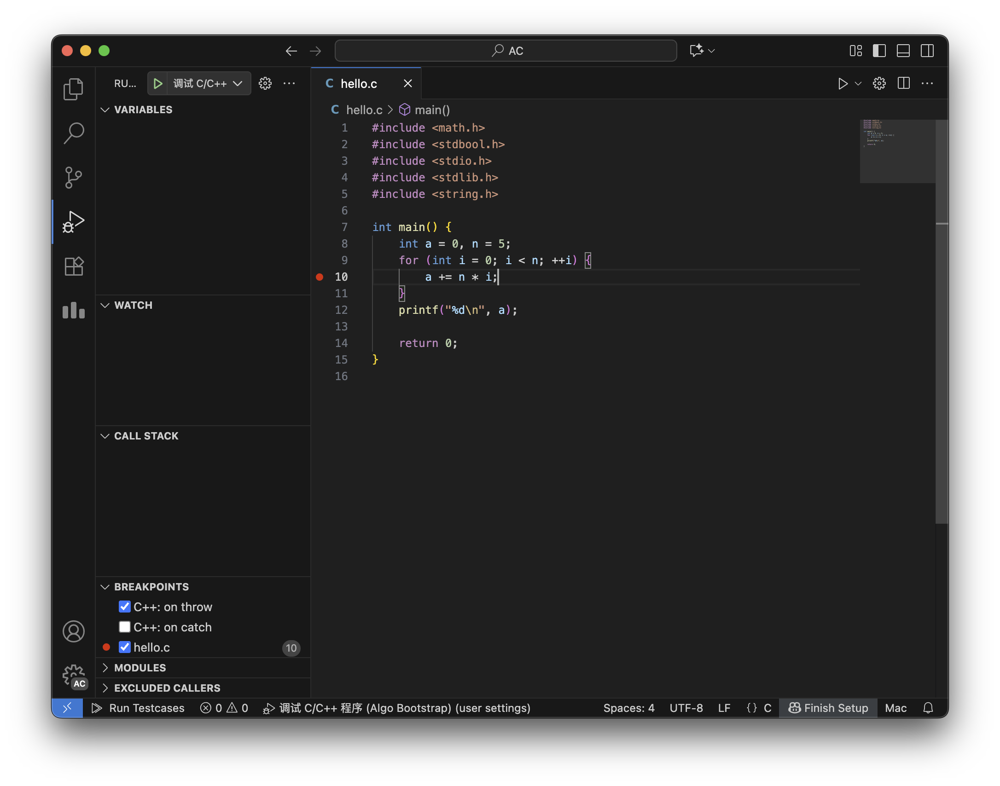
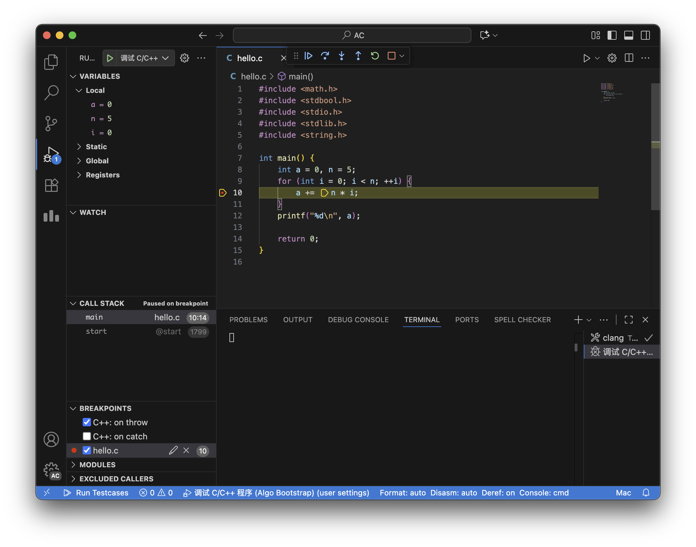

# 调试程序

Algo Bootstrap 已内置了开箱即用的 C/C++ 程序的断点调试功能。某些时候，使用单步断点调试可以帮助你更容易理解复杂的循环和递归调用。

## 使用方式

在需要中断执行的行的行号左侧，点击红点以设置断点，这样当进入调试模式时，程序会在每个断点位置等待。

点击活动栏的「Run and Debug」图标以切换。确保上方的调试配置选择为「调试 C/C++ 程序 (Algo Bootstrap)」，点击绿色运行按钮启动调试。

稍后调试将开启，并运行到第一处断点位置等待。当前即将执行的行将以默认黄色高亮显示，底部状态栏将显示为蓝色。

你的程序的输入和输出都在「Terminal（内置终端）」中交互。如果默认打开的下方面板为「Debug Console」，你需要点击右侧的三圆点按钮（`···`），切换到「Terminal」面板。

接下来介绍调试状态下的一些基本操作。左边主侧边栏的「VARIABLES」区域会显示当前作用域和父级作用域内的变量和值。以上图为例，你可以看到当前执行位置 `a` `n` `i` 变量的具体值。通常你只需要关注这个区域。

在编辑器区域的上方，将会显示一个调试操作条，你可以移动它的位置。操作条上的按钮从左到右依次为：
- `Continue`：继续执行，通常这会放行程序，直到下一个断点位置
- `Step Over`：单步执行，程序将顺序执行下一个语句，这是最常用的操作
- `Step Into`：进入函数，程序将进入函数内部执行
- `Step Out`：退出函数，程序将退出当前函数，返回上一个调用位置
- `Restart`：重新开始
- `Stop`：停止调试

尝试点击「Step Over」按钮，程序执行一步，在当前 for 循环的结束位置；再次点击，程序将跳转到 for 循环的开始位置；继续点击，此时观察到 `i` 已增加到 `1`，程序进入第二轮 for 循环；本轮循环结束时，`a` 的值增加到 `5`。以此类推，直到循环结束，可以观察到 `a` `n` 的最终值。

不需要继续调试时，可以点击 `Continue` 按钮放行到结束或点击 `Stop` 按钮停止调试。
