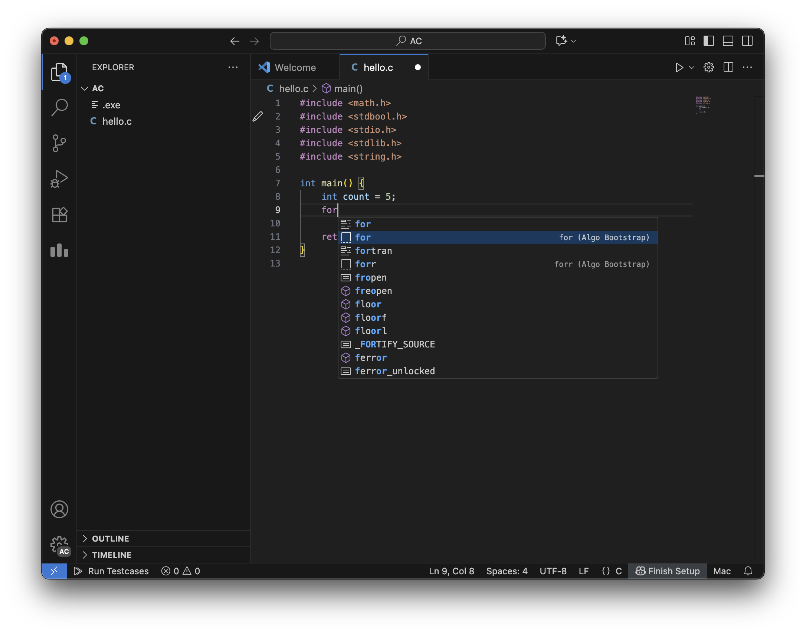

# 使用代码片段

Algo Bootstrap 内置了丰富的代码片段，便于加速代码编写。

## 使用方式

在 VS Code 的代码编辑区域键入特定的触发词前缀即可显示建议，通过方向键选择 Algo Bootstrap 相关的代码片段，按 `Tab` 键即可在当前光标位置插入代码片段。

以 for 循环为例，其包含了多个跳转点。首先是 `i` 变量，光标将在所有 `i` 处闪烁，你可以输入内容来修改所有的 `i`。若不需要修改或修改已毕，继续按 `Tab` 跳到下一处（`count` 变量）。重复操作，直至跳到 for 代码块内部的最终落点（`/* code */`），即可开始输入循环内的代码。

## 支持的代码片段

Algo Bootstrap 内置的代码片段：

- `for`：for 循环
- `forr`：反向 for 循环
- `foreach`：range-based for 循环（`C++` Only）
- `while`：while 循环
- `do`：do while 循环
- `switch`：switch 语句
- `if`：if 语句
- `else`：else 语句
- `else if` / `elif`：else if 语句
- `try`：try catch 语句（`C++` Only）
- `cout`：cout 语句（`C++` Only）
- `#ifdef`：#ifdef 语句
- `#ifndef`：#ifndef 语句
- `main`：生成 main 函数
- `ac`：生成完整的初始代码（可在 Algo Bootstrap 中自定义，详见 [设置代码初始化模板](/usages/advanced/template)）

## 支持的语言

代码片段支持如下的语言：

- C
- C++
